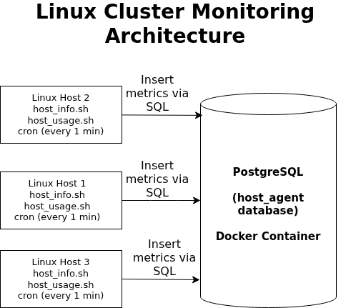

# Linux Cluster Monitoring Project

## Introduction
The Linux Cluster Monitoring Project is a centralized monitoring solution designed to collect, store, and analyze system-level metrics from multiple Linux servers in a cluster environment. The project captures both static hardware information and real-time resource usage data, enabling infrastructure and operations teams to monitor performance trends and make informed capacity and optimization decisions.

The solution uses a lightweight agent-based approach where each Linux host collects its own metrics using native system utilities. All collected data is stored in a centralized PostgreSQL database, allowing historical analysis through SQL queries. Automation is achieved through cron scheduling, ensuring continuous monitoring without manual intervention.

Primary users of this system include system administrators, DevOps teams, and business systems analysts who require reliable visibility into server performance. The project is implemented using Bash scripting, Docker, PostgreSQL, Git, cron jobs, and SQL.

---

## Quick Start

```bash
# Start PostgreSQL using Docker
bash scripts/psql_docker.sh start

# Create database tables
psql -h localhost -U postgres -d host_agent -f sql/ddl.sql

# Insert host hardware information
bash scripts/host_info.sh

# Insert host usage metrics
bash scripts/host_usage.sh

# Edit crontab for automation
crontab -e

# Run every minute
* * * * * bash /absolute/path/to/scripts/host_usage.sh >> /tmp/host_usage.log
Implementation
The project is implemented as a centralized monitoring system with distributed data collection. Each Linux host runs monitoring scripts that gather system information using standard Linux commands. Static host metadata is collected once per host, while usage metrics are collected at regular intervals.

PostgreSQL serves as the centralized data store and is deployed using Docker to ensure consistency across environments. Cron is used to automate the execution of monitoring scripts, enabling continuous and unattended data collection. SQL queries are used to analyze collected data and support operational and business-level insights.

Architecture



The system follows a centralized monitoring architecture consisting of multiple Linux hosts acting as monitoring agents. Each host collects metrics using Bash scripts and inserts the data into a centralized PostgreSQL database running inside a Docker container.

Scripts
psql_docker.sh
Manages the PostgreSQL Docker container lifecycle, including starting, stopping, and checking the status of the database service.

Usage:

bash psql_docker.sh start|stop|status
host_info.sh
Collects static hardware information such as hostname, CPU count, total memory, and operating system details. This script is designed to run once per host.

host_usage.sh
Collects dynamic system usage metrics including CPU usage, memory usage, disk activity, and timestamps. This script is designed to run repeatedly to build time-series monitoring data.

cron
Automates execution of the monitoring process by scheduling host_usage.sh at fixed intervals.

queries.sql
Contains SQL queries used to analyze monitoring data and support operational and business decisions.

Database Modeling
host_info
Column Name	Description
id	Unique identifier for each host
hostname	Host machine name
cpu_number	Number of CPU cores
total_mem	Total memory (KB)
os	Operating system
host_usage
Column Name	Description
timestamp	Time of metric collection
host_id	Reference to host_info table
cpu_usage	CPU utilization
memory_free	Available memory
disk_io	Disk activity
Test
Testing was performed through manual execution of Bash scripts and verification of database inserts using PostgreSQL queries. Cron jobs were tested by monitoring log files and confirming that usage data was inserted at scheduled intervals without duplication or failures.

Deployment
The project is deployed using Docker for PostgreSQL database management, cron jobs for automated metric collection, and GitHub for version control. This approach ensures portability, automation, and ease of maintenance.

Improvements
Implement alerting for resource threshold breaches

Add dashboards for visual analysis

Collect additional metrics such as network usage

Enhance security and access control

Scale the solution to support multiple clusters
