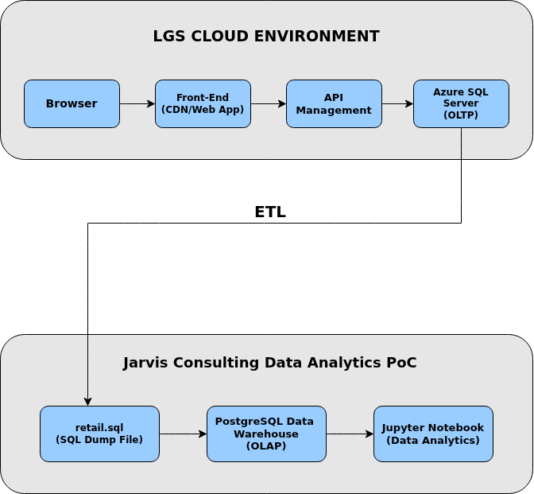

# Python Data Analytics - London Gift Shop (LGS)

## Introduction

London Gift Shop (LGS) is a UK-based online retailer specializing in giftware products. Although the company has been operating for over a decade, recent revenue growth has slowed. The marketing team aims to leverage historical transaction data to better understand customer purchasing behavior and identify opportunities to improve sales performance.

This Proof of Concept (PoC) project focuses on analyzing retail transaction data to generate actionable business insights that can support targeted marketing campaigns and revenue optimization strategies.

The analysis was performed using Python, Jupyter Notebook, Pandas, NumPy, and PostgreSQL.

---

## Implementation

In the production environment, customer transactions flow from the front-end web application through an API layer into an Azure SQL Server (OLTP database).

For this PoC, direct access to the Azure environment was not provided. Instead, the LGS IT team exported transactional data into a SQL dump file (`retail.sql`) through an ETL process.

The workflow for this project is:

1. Transaction data is extracted from Azure SQL Server.
2. The data is delivered as a SQL dump file.
3. The dump file is loaded into a PostgreSQL data warehouse (OLAP environment).
4. Data cleaning, transformation, and analysis are performed in a Jupyter Notebook.
5. Business insights are generated for the LGS marketing team.

---

## Project Architecture

The diagram above illustrates the separation between the LGS cloud environment and the Jarvis consulting PoC environment. Transaction data is first stored in Azure SQL Server (OLTP) within the LGS cloud architecture.

Through an ETL process, the data is exported and loaded into a PostgreSQL data warehouse. The Jupyter Notebook serves as the analytics layer, where data wrangling and analysis are performed to produce actionable business insights.

---

## Data Analytics & Wrangling

The dataset contains invoice-level transaction records, including invoice number, stock code, product description, quantity, invoice date, unit price, customer ID, and country.

Data preparation steps include handling cancelled transactions, removing invalid or missing customer records, correcting data types, and creating derived metrics such as revenue (quantity × unit price).

Aggregations and exploratory analysis are performed to identify key revenue drivers, top-performing products, geographic sales distribution, and time-based purchasing trends.

The complete implementation is available in the following notebook:

[Retail Data Analytics Notebook](./retail_data_analytics_wrangling.ipynb)

---

## Improvements

If additional time were available, the project could be enhanced by:

- Automating the ETL process for continuous data refresh.
- Building interactive dashboards using Power BI or Streamlit.
- Implementing predictive modeling for sales forecasting and customer segmentation.
- Scheduling data pipelines and adding monitoring for production readiness.
